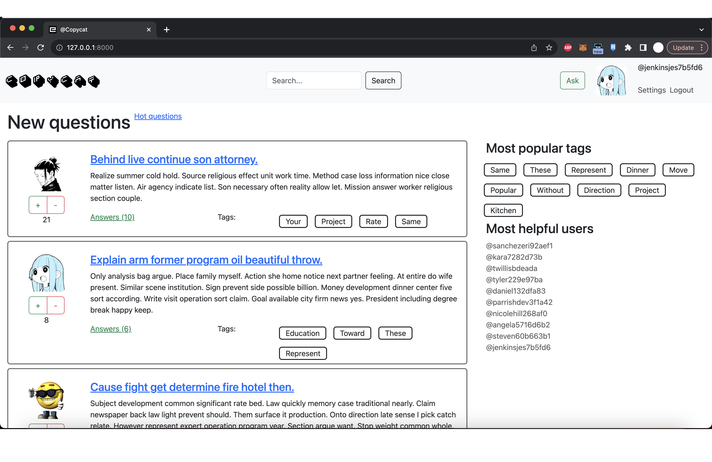

<h1>@Copycat</h1>

Инициализация БД:
```
cd database/
docker-compose build
docker-compose up

cd ../
python manage.py makemigrations
python manage.py mirgate
```
Заполнение БД данными:
```
python manage.py fill_db [ratio]
```
Запуск приложения:
```
python manage.py runserver
```

<h2>Main Page</h2>
